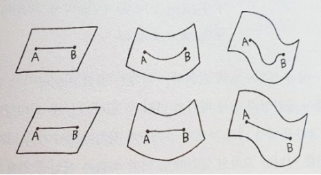

> 인플루엔셜 출판사의 『수학이 필요한 순간-인간은 얼마나 깊게 생각할 수 있는가(김민형 저)』을 읽고 작성한 리뷰입니다.

<!--more-->

1. this ordered seed list will be replaced by the toc
{:toc}

## 기본 정보
---
### 저자
**김민형 (1963~)**   
   
1963년 대한민국 서울 출생, 인문학자 김우창 교수의 아들   
서울대학교 수학과 전공
예일대 수학과 박사   
‘페르마의 마지막 정리’에서 유래된 산술 대수 기하학의 고전적인 난제를 정수론과 위상수학을 결합한 혁신적인 방식으로 해결하여 세계적인 반열에 오른 한국인 수학자
2012년 호암과학상 수상   
한국인 최초 옥스퍼드대학교 수학과 교수 재임(2012-2020) 
한국고등과학원 석학교수

### 사적
『소수 공상』(2013),  
『아빠의 수학여행』(2014),   
『수학의 수학』(2016),   
『수학이 필요한 순간』(2018),   
『다시, 수학이 필요한 순간』(2020),   
『역사를 품은 수학, 수학을 품은 역사』(2021),   
『삶이라는 우주를 건너는 너에게』(2022)   

### 내용
수학적 이해력이 무엇이고, 어떻게 활용되고 있는지 서술 

## 챕터별 정리
---

### 서문

  수학의 발전은 컴퓨터·물리학·경제학·생물학·공학·인공지능 등 거의 모든 분야와 밀접하게 연결되어 있으며, 이렇게 추상적 구조와 자연 현상, 강력한 기계 장치의 구성과 작용에 대한 사고는 계속해서 심화되고 있다. 이 과정에서 깊은 수학적 이해력이 필요하다.
   
  그렇다면 수학적 사고란 무엇인가? 자연·사회·우주·정보 등 인간을 둘러싸고 있고, 인간이 만들어내고 있는 것들을 탐구하는 방법이다. 또는 답보다 질문을 먼저 찾아내고, 그 속에서 구조와 패턴, 규칙성과 오류를 발견하여 논리를 활용해 문제를 해결해 나가는 일련의 과정이기도 하다.   

 

### 1강. 수학은 무엇인가
   대부분의 학문은 질문이 있고 논리를 이용하여 그 답을 풀기 위한 과정
    
   수학이란, 추상적인 개념적 도구를 사용해 세상을 체계적으로 정밀하게 설명하려는 것
    
 - ex) 인문학 : (인류학자 클로드 레비스트로스<small>Claude Levi-Strauss</small>) 여러 사회를 분류하고 구조적인 유사성을 찾기 위해 구조주의 활용 
    => '구조'의 개념을 명확하게 정의하고 설명하려면 수학적인 구조, 수체계, 군론 등에 대한 이해 필요
    
 - ex) 생물학 : (19C 찰스 다윈)자연의 분류에서 자연의 원리에 대해 의문을 가지고 탐구하기 시작하면서 **진화론**이 구축되기 시작 
    => 확률론을 이용한 유전론으로 발전

> "우리가 우주를 이해하기 위해서는 우주에 관해 쓰여 있는 언어를 배우고 친숙해져야 하는데, 그 언어는 수학적인 언어다. 가령 언어의 글자들은 삼각형, 원, 기하학적인 모양들일 수도 있다. 이런 단어가 없이 우리는 우주를 한 단어도 이해할 수 없다. 이런 것들을 모르고는, 이런 언어가 없다면 어두운 미로를 방황하는 것과 같다."   
> <small class="figcaption">갈릴레오 갈릴레이(Galileo Galilei)</small>

 

### 2강. 역사를 바꾼 3가지 수학적 발견
1. 페르마의 원리(by 피에르 드 페르마<small>Pierre de Fermat</small>)   
빛의 굴절에 대한 원리
> 빛은 시간을 최소화하는 경로로 진행한다
 
   - 물과 공기가 있고 물 밖에서 사람의 눈이 물 속 동전을 바라볼 때, 위치가 굴절되어 보임
   - 빛이 공기보다 물을 통과할 때 상호작용이 많아져 속도가 느려짐
     - 빛이 물체와 부딪힘
     - ∴빛은 입자로 이루어져 있음
2. 《자연철학읜 수학적원리(프린키피아)》(by 아이작 뉴턴<small>Isac Newton</small>)
 
   1) 미분과 만유인력의 법칙   
   (A) 힘을 가하면 가속도[^1]가 생긴다   
   (B) 힘이 클수록 가속도는 커진다   
   (C) 가속도는 힘에 비례한다.   
      > $$ a = cF  (a:가속도, c:상수, F:힘) $$
         - 미분(derivative) : 속도가 변하는 정도(가속도)를 계산
         - c
           - 힘이나 가속도에 의존하지 않는 상수
           - 물체에 의존하는 양
           - 물건의 크기(질량)가 m일때, $c=\frac{1}{m}$
             - $$ a = \frac{1}{m}*F $$ 
             -  $$ F = ma $$    
     1) 중력은 2개의 물체 사이에서 어떻게 작용하는가? 
         - 중력은 질량에 비례하고 거리의 제곱에 반비례한다.
           - $$ 
             F = G*\frac{Mm}{r^2} 
              (F: 중력,G:상수,M:물체1의 질량,m:물체2의 질량,r:거리)
            $$
           - 케플러의 법칙($주기^2÷거리^3$)을 재현하는데 성공 
         - 2개의 물체 사이의 중력을 계산하기 위해 각 표면별 중력을 연속적으로 더하여 계산
           - 적분(integral)
           - 물체간 중심 사이의 거리와 동일
1. 좌표의 발견 (by 르네 데카르트<small>René Descartes</small>)
 
   - 기하학을 대수적인 방법, 즉 언어로 표현할 수 있는 개념의 틀
     - ex) 타원의 방정식 
       - (이전) 원뿔을 비스듬하게 잘랐을 때 생기는 곡선
       - (좌표) $\frac{x^2}{a^2}+\frac{y^2}{b^2} = 1$
   - (뉴턴) 좌표와 관계없는 불변량
     - 좌표계를 다르게 설정했을 때, 물리적인 현상·원리·법칙은 어느 좌표계를 통해 보든 일관성이 있어야 한다
     - 코페르니쿠스·케플러·갈릴레오의 **지동설**
       - 움직이지 않는 좌표는 없다
     - 일정한 속도로 움직이는 좌표계도 자연 현상을 묘사하는게 적절하다
       - 속도(움직임)는 좌표에 상대적인 양
       - 가속도(속도의 변화)는 객관적인 양
       - 두 좌표 사이의 관계를 규명할 때 공간 좌표는 시간 좌표에 의존
   - (아인슈타인) 상대성이론
     - 시간은 상대적이다
  
 

### 3강. 확률론의 선과 악
- 《산수,기하학,비례와 비례적인 것들의 대전》(by 루카 파치올리<small>Fra Luca Bartolomeo de Pacioli</small>)  
  1. 복식부기법<small>Double Entry Book Keeping</small>
     - > 자산 = 자본 + 부채
  2. 점수의 문제<small>Problem of Points</small>
     - 게임이 중단되었을 때, 판돈을 어떻게 나눌 것인가?
       - (루카 파치올리) 중간 점수에 따라 비율로 나눔
       - (니콜로 타르탈리아) 해결할 수 없음
         - 100점 내기에서 1:0이면 1승만으로 모든 판돈을 가지는건 불합리
       - (페르마-블레즈 파스칼<small>Blaise Pascal</small>) 이길 확률인 기대값으로 배분
- 결과주의는 확률론적인 성격이 강함
  - 최대다수의 최대행복을 추구하는 공리주의도 일종의 기댓값
  - 하나의 행위에 도출될 좋은 결과/나쁜 결과의 확률에, 어느 정도의 확률로 연쇄적인 파급 효과
  - 선하다고 결정한 것도 악한 결과를 가지고 올 확률이 있고, 악하다고 생각한 것도 선한 효과가 있을 수 있음
    - 선하고 악한 것은 얼마나 확률적인가?
  
 

### 4강. 답이 없어도 좋다
- 민주주의    
  = 중요한 의사결정을 할때 구성원 대다수가 원하는 요구조건을 이뤄낼 수 있는 사회 체제 
  - 어떻게 의사결정을 할 것인가?
    - 사회선택 이론   
      다수결 선거, 단순다수대표제, 보르다 투표(Borda Count Method), 결선제, 콩도르세의 방법...
    - 불가능성의 정리(애로의 정리, Kenneth Joseph Arrow)
      - 사회선택 이론의 중요 기반
        1) 의견일치의 원리 : 모든 사람이 나와 같은 생각을 한다
        2) 독립성의 원리 : 다른 후보의 존재 유무에 따라 결과가 바뀌어서는 안된다 
        3) 독재자는 존재하지 않는다 : 어느 한 개인의 의견이 항상 사회 결정으로 반영되는 상황이 있으면 안된다
      - 후보가 적어도 3명이 있는 선거에서는 이 법칙을 모두 만족하는 방법론이 없음
        - 뉴턴의 법칙은 방적식의 해를 찾은 경우지만, 애로는 해가 없는 경우
        - 불가능성의 제약으로부터 시작해서 어떤 연구를 할 수 있는가? 
  
 

### 5강. 답이 있을 때 찾을 수 있는가
- 잠정수락<small>deferred acceptance</small> 알고리즘   
  = 게일-섀플리 알고리즘<small>Gale-Shapley Algorithm</small>
  - 서로에 대해 선호를 가진 집단 간에 안정적인 매칭을 찾아내는 알고리즘
    - 선호도가 아무리 복잡해도 답은 항상 있으며, 해를 효율적으로 찾을 수 있음을 증명
    - 수학적 사고가 무엇인지 구체적인 예로 보여주는 목적으로 작성됨
- ∴ 문제를 단순화한 다음, 더 복잡한 모델이나 강력한 요구 조건을 만들며 개선점을 찾아 나가는 것이 과학이 하는 일
 
 

### 6강. 우주의 실체, 모양과 위상과 계산
1. 위상 수학<small>topology</small>
   - 거시적인 기하
   - 정밀한 기하는 무시하고, 크게 보았을 때 모양이 어떻게 단순한 형태로 조립되어 있는지가 기호로 저장됨
     - ex) 점 A, B, C로 구성된 삼각형이 있을 때,   
       {A}, {B}, {C}, {A,B}, {B,C}, {C,A}, {A,B,C}로 표현
  - <strong> 오일러의 수 </strong>
    - 점, 선, 삼각면으로 이루어진 임의의 물체가 있으면 다음의 양이 중요하다
    - > 면의 갯수 - 선의 갯수 + 점의 갯수
      - 위상이 같은 두 모양은 같은 오일러 수를 가짐
      - 거시적 정보를 기호화하고 계산해서 모양을 구분하는 방법
2. 내면 기하 (by 가우스<small>Carl Friedrich Gauss</small> + 리만<small>Bernhard Riemann</small>)
  - 기하를 생각할 때 그 물체의 내부의 관점에서 어떤 성질들을 표현하고 측정  
   
    - 면 위에서 보면 거리의 차이가 없음 
  - <strong> 리만 곡률 </strong>
    - 내면 기하에 바뀌는 걸 측정하는 것
    - 내면 기하게 바뀐다는 건 내적인 성질이 바뀐다는 것
      - 일반 상대성 이론에 따르면, 중력을 느낀다는 것 자체가 시공간의 곡률을 느끼는 과정
3. 알렉산더 그로탕디에크<small>Alexander Grothendieck</small>
   - 대수로부터 기하를 만드는 과정을 발견
   - 수체계 하나가 주어지면 그 수체계만을 가지고 기하를 만들 수 있음
  
 

## 후기
---
#### 직관적인 사고 함양의 필요성 
수학은 사칙연산을 정확하게 알고 계산하는 정도만으로도 생활에 지장이 없다고 생각하던 10대 시절이 있었다. 실제로 금융업이나 공학 설계 등 수학이 직접적으로 필요한 분야에 종사하지 않는다면 이 생각이 그리 틀리진 않았다고 지금도 생각한다.  

그러나 시간이 흐르고 발전한 기술 문명의 혜택을 무심결에 누리고만 있던 지금의 나는, 어느 순간 나를 둘러싸고 있는 세상의 동작 원리가 궁금해졌다. AI는 어떻게 데이터를 "학습"하는가? 컴퓨터는 0과 1만으로 어떻게 문자를 인식하고 처리하는가? 센서는 어떻게 내 손의 터치감을 인식하는가? 닥터 스트레인저는 수많은 세계선을 보고 왔음에도 어벤저스 팀과 동일한 시간에 숨쉬고 있을 수 있는 이유는 무엇인가? 
  
그렇게 궁금증을 조사하다 보면 다시 수학으로 돌아오게 되었다. 그러나 수능을 위한 미적분과 통계를 마지막으로 수학 공부를 하지 않은지 10년이 흘렀고, 수능 수학이 사실상 공식을 외워 수능문제를 잘 풀기 위한 목적임을 상기해봈을때 《수학의 정석》을 다시 펼쳐서 문제풀이하는 방법이 수학을 제대로 공부하는 방법인지 확신할 수 없었다.    
수학에 대한 갈망에 목말라있던 시기에 도서관에서 발견한 책이 《수학이 필요한 순간》이다. 우리가 흔히 알고 있는 수학적 공리가 어떻게 증명되었는지, 어떤 의미가 있는지를 넘어서 수학의 가장 중요한 본질인 "문제를 이해하고 단순화한 후 답을 찾아나가는 사고"에 대해 배울 수 있었던 소중한 시간이 되었다.   
나는 스스로 사고하는 순간이 매우 드물다. 공식이 주어지면 이용하여 문제를 해결하는 데 익숙해져있지, 이 공식에서 파생될 수 있는 질문이나 공식의 타당성을 생각하지 않는다. 제대로 질문을 던질 수 있다는 것이야말로 그 현상을 내면으로부터 완전히 이해하고 있다는 방증이지 않을까. 질문하기 위해서는 먼저 이해하고 따져보며 예시를 생각해보면서 스스로 납득하는 과정이 필요하지 않을까.   

[^1] : 속도가 변하는 정도   
